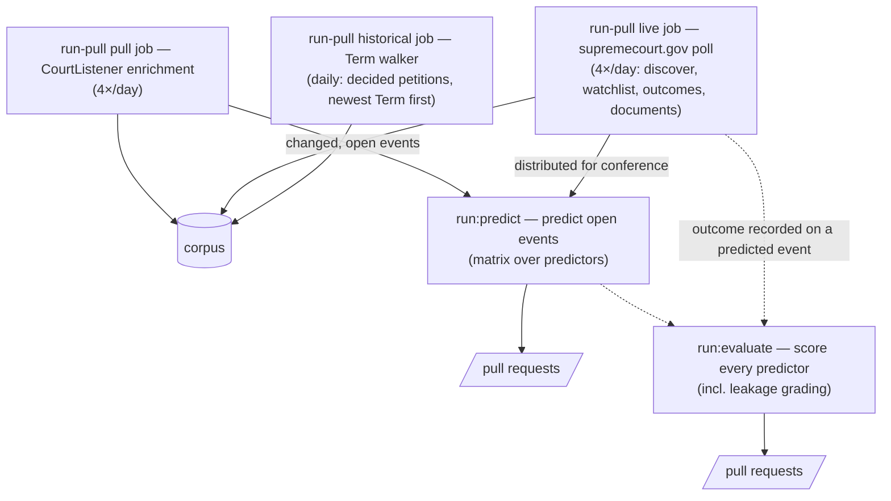

# FedCourtsAI

[](https://github.com/ModelMirrorAI/fedcourtsai/actions/workflows/ci.yml)
[](https://github.com/ModelMirrorAI/fedcourtsai/actions/workflows/lint-actions.yml)
[](https://github.com/ModelMirrorAI/fedcourtsai/actions/workflows/codeql.yml)
[](https://www.python.org/)
[](LICENSE)

Agentic AI system to predict events in US federal courts — for example, whether
a motion before a court of appeals or the Supreme Court will be granted or
denied, the likely vote of each judge or justice, and a detailed prediction of
the court's reasoning.

> **Status:** early scaffold. The pipeline shape, data contract, and automation
> are in place; data production runs through the label-driven workflows below,
> and pipeline development happens in agent-assisted Codespaces sessions on the
> ordinary branch-and-PR flow (see [`AGENTS.md`](AGENTS.md)).
>
> Pilot predictions are accumulating in the open ledger under `data/`, but none
> has resolved or been scored yet — the first published-results target is the
> OT2026 long-conference cert release (see [milestones](docs/milestones.md)).

> **Not legal advice.** Outputs are experimental model predictions — they may be
> wrong, carry no affiliation with or endorsement by any court, and are not legal
> advice or a forecast you should rely on for any decision.
>
> Predictions about how individual judges or justices may vote describe *likely
> outcomes* — they are not assertions of fact and not statements about how anyone
> should decide.

## How it works

The project runs as a **label-driven pipeline of GitHub Actions**. Work is
represented as GitHub issues; applying a `run:*` label triggers the matching
workflow. When a stage needs to hand off, it opens (or labels) an issue to
trigger the next stage. Several stages delegate to agentic coding tools
(Claude Code, Codex, and Gemini), which branch, do the work, and open a pull
request.

| Label          | Workflow        | Does                                                                 | Engine |
|----------------|-----------------|----------------------------------------------------------------------|--------|
| `run:pull`     | `run-pull`      | Three scheduled jobs: targeted CourtListener enrichment (four windows/day), the **supremecourt.gov live poll** (four windows/day) that discovers pending petitions, tracks conference distribution, records outcomes, and provisions filed-document text, and the daily **historical Term walker** that accumulates decided petitions newest-Term-first for base rates and back-testing | Script |
| `run:predict`  | `run-predict`   | Predict open events with **multiple competing predictors** (fan-out) | Claude Code + Codex + Gemini |
| `run:evaluate` | `run-evaluate`  | Score past predictions against realized outcomes (evaluator × predictor) | Claude Code + Codex + Gemini |

Plus `run-ops`, a read-only daily dashboard — run health, substantive results
(scored cells, calibration, live-frontier readiness), spend — with a weekly
maintainer digest, and no `run:*` label: it runs on a schedule (or manual
dispatch). See [`docs/pipeline.md`](docs/pipeline.md).



Longer term, an automated-research harness (in the spirit of Anthropic's
[automated alignment researchers](https://www.anthropic.com/research/automated-alignment-researchers))
proposes new predictor designs, registers them as new entries in the predictor
registry, and lets them compete — so `run-predict` tracks a growing field of
agents and `run-evaluate` is the tournament that ranks them.

## Prediction scope

Ingestion covers all fourteen courts, but the agentic predict/evaluate stages are
**deliberately narrower** — we predict only where the event model fits and ground
truth is recoverable, and would rather be upfront about what is left out than
publish predictions we can't stand behind. Currently out of scope:

- **Everything that is not a SCOTUS docket.** Prediction is gated to Supreme
  Court dockets themselves; originating court-of-appeals dockets — including
  remand activity after a grant — and appeals that never reach SCOTUS are
  ingested for context and retrieval but not
  predicted. (Scope dial, not a permanent limit — see [`docs/budget.md`](docs/budget.md).)
- **Pre-1925 mandatory-jurisdiction matters.** The cert event model targets the
  modern *discretionary* certiorari regime; pre-1925 appeals heard as of right
  carry a different disposition meaning, so they are excluded rather than scored
  under a label that does not apply.
- **Stale, unresolvable petitions.** Some decades-old Supreme Court dockets survive
  only as bare stubs — no docket entries, no recorded disposition — that the corpus
  can never resolve. They are excluded rather than predicted in perpetuity against
  ground truth that does not exist.
- **Non-cert SCOTUS docket forms.** Stay/emergency applications (`22A123`) and
  original-jurisdiction matters (`22O141`) resolve as stays or merits rulings,
  not cert grant/deny, so the cert event model is not scored against them.
- **Decided-on-paper-only cases.** A docket whose only outcome signal is a
  published opinion with no machine-readable disposition, or a bare bulk-import
  row whose snapshot carries nothing to predict from, is excluded until real
  record data arrives.
- **Cases with internally inconsistent dates.** A docket that looks decided before
  it was filed (a faithful but nonsensical upstream record) can't anchor a
  meaningful prediction, so it is excluded — without altering the data or the
  validation monitor that tracks the count.

These exclusions are applied deterministically from the corpus at the prediction
matrix, and any predictions merged for such cases before an exclusion landed are
pruned by a maintainer-run cleanup sweep (the tested
`cleanup-out-of-scope-predictions` command, run locally and landed as a reviewed
PR). Scope will widen as the project matures; the
mechanics live in [`docs/pipeline.md`](docs/pipeline.md) and
[`docs/data-pipeline.md`](docs/data-pipeline.md).

## Data model

State lives in two stores, split by kind. **Raw facts** — dockets, snapshots,
judges, case and event metadata — go into a packed **corpus** (SQLite under
DVC/S3), written identically by every ingestion channel. **Derived artifacts** are
versioned as files in git, organized **case-centrically** so everything we
conclude about a single predictable event lives together:

```
data/cases/<court_id>/<docket_id>/events/<event_id>/
  outcome.json                   # ground truth, once the event resolves
  predictions/<predictor_id>/<run_id>/
    prediction.json              # quantitative: granted 1/0, P(granted), votes
    reasoning.md                 # qualitative: predicted reasoning
  evaluations/<evaluator_id>/<predictor_id>/<run_id>/
    evaluation.json
    evaluation.md
```

Every git artifact validates against a pydantic model in `fedcourtsai.schemas`
(exported to `schemas/*.schema.json`). See [`docs/data-model.md`](docs/data-model.md)
for the rationale and [`docs/data-pipeline.md`](docs/data-pipeline.md) for the
corpus.

## Develop

Requires [uv](https://docs.astral.sh/uv/). A devcontainer is included
(`.devcontainer/`) and is the recommended way to work in Codespaces.

```bash
uv sync                       # install deps into .venv
uv run fedcourts --help       # CLI (full reference: docs/cli.md)
uv run fedcourts export-schemas
uv run fedcourts validate data

# the local gate CI also runs:
uv run ruff format --check .
uv run ruff check .
uv run mypy
uv run pytest
```

`pull` is a single-docket REST helper that fetches one case from the
CourtListener REST API into the corpus through the shared ingestion core, so it
needs a free API token. The first pull of a docket onboards it; later pulls
refresh it and report whether it changed:

```bash
export FEDCOURTS_COURTLISTENER_API_TOKEN=...   # https://www.courtlistener.com/help/api/rest/
uv run fedcourts pull --court ca9 --docket <docket_id>   # onboard/refresh one docket
```

Historical mass is loaded by the `run-pull` workflow's deterministic, no-agent
`historical` job — the Term walker: chunked against resumable cursors into the
*same* corpus through the *same* core, sampling decided SCOTUS petitions from
the supremecourt.gov docket JSON (no API budget):

```bash
uv run fedcourts historical-terms --report historical-report.json   # load the next chunk
```

See [`docs/live-sources.md`](docs/live-sources.md) and
[`docs/data-pipeline.md`](docs/data-pipeline.md).

## For AI agents

Start with [`AGENTS.md`](AGENTS.md) — it is the canonical instruction file and
defines the branch-and-PR workflow every agent follows. `CLAUDE.md` points to it.

## Repository layout

```
src/fedcourtsai/    library: CourtListener client, schemas, paths, registry, CLI
config/             predictor & evaluator registries, tracking settings
data/               tracked cases (versioned)
schemas/            JSON Schema exported from the pydantic models
docs/               architecture, data model, pipeline, security
.github/workflows/  the label-driven pipeline + CI + workflow linting
.github/prompts/    engine-agnostic prompts used by Claude Code, Codex, and Gemini
```

## Documentation

- [Architecture](docs/architecture.md)
- [Data model](docs/data-model.md) · [Data pipeline](docs/data-pipeline.md) (the corpus)
- [Data sources, terms & PII](docs/data-sources.md)
- [Pipeline & labels](docs/pipeline.md)
- [CLI reference](docs/cli.md)
- [Budget](docs/budget.md)
- [Milestones](docs/milestones.md)
- [Security](SECURITY.md) · [setup runbook](docs/security.md)
- [Agent workflow](docs/agent-workflow.md) · [Testing](docs/testing.md) · [Contributing](CONTRIBUTING.md)

## Data & attribution

Court data comes from [CourtListener](https://www.courtlistener.com/), a project of
the [Free Law Project](https://free.law/) — via the CourtListener REST API and the
quarterly bulk-data exports. A great deal of this project rests on their work;
please review and support it. Use of their data is governed by
[CourtListener's terms](https://www.courtlistener.com/terms/) (CC BY-ND 4.0 for
CourtListener's own content; the underlying federal records are public domain), with
attribution also recorded in the top-level [`NOTICE`](NOTICE).

The derived corpus is **not** publicly republished — it stays in an access-gated
store; only our model-generated judgments over those public records reach public
git. We ingest only public-record dockets and never sealed or privileged material.
See [docs/data-sources.md](docs/data-sources.md) for the full position on terms,
redistribution, the API budget, and PII.

FedCourtsAI is independent and is **not** affiliated with or endorsed by the Free
Law Project or any court. Court records are public records of the U.S. federal
courts; the predictions and evaluations in this repository are model-generated and
are not official court records.

## License

MIT — see [LICENSE](LICENSE).
