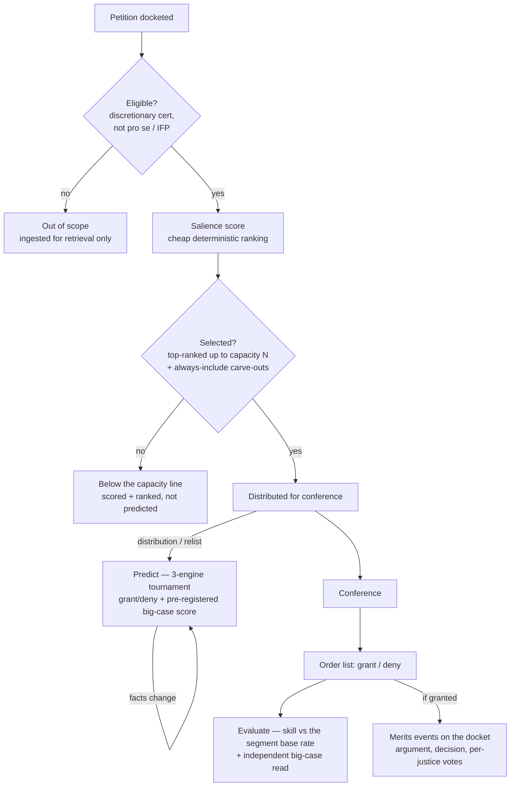

# FedCourtsAI

[](https://github.com/ModelMirrorAI/fedcourtsai/actions/workflows/ci.yml)
[](https://github.com/ModelMirrorAI/fedcourtsai/actions/workflows/lint-actions.yml)
[](https://github.com/ModelMirrorAI/fedcourtsai/actions/workflows/codeql.yml)
[](https://www.python.org/)
[](LICENSE)

Agentic AI system to predict events in US federal courts — for example,
whether a petition for certiorari will be granted or denied, the likely vote
of each justice, and the court's reasoning.

> **Status:** the pipeline is live. Ingestion runs daily across the Supreme
> Court and the thirteen courts of appeals, the supremecourt.gov live channel
> tracks pending cert petitions in production, and the forward record begins
> with the OT2026 cert cycle: the open ledger under `data/` holds SCOTUS
> events and realized outcomes, with predictions and evaluations accumulating
> toward the OT2026 long-conference cert release ([milestones](docs/milestones.md)).

> **Not legal advice.** Outputs are experimental model predictions — they may
> be wrong, carry no affiliation with or endorsement by any court, and are not
> legal advice or a forecast to rely on for any decision. Predictions of how
> individual judges or justices may vote describe *likely outcomes* — not
> assertions of fact, and not statements about how anyone should decide.

## How it works

The project runs as a **label-driven pipeline of GitHub Actions**: work is
represented as GitHub issues, applying a `run:*` label triggers the matching
workflow, and a stage hands off by opening (or labeling) an issue for the next
stage. The judgment-heavy stages delegate to **multiple competing coding
agents** (Claude Code, Codex, and Gemini), whose artifacts land as
auto-merge-gated pull requests.

| Label          | Workflow        | Does                                                                 | Engine |
|----------------|-----------------|----------------------------------------------------------------------|--------|
| `run:pull`     | `run-pull`      | Two scheduled forward writer jobs: targeted CourtListener enrichment, and the **supremecourt.gov live poll** (discovers pending petitions, tracks conference distribution, records outcomes, provisions filed-document text) | Script |
| _(none)_       | `run-seed`      | The **historical Term walker** (supremecourt.gov, budget-free) backfilling past Terms for base rates and back-testing — four dead-zone windows a day, sharing run-pull's corpus-write lock | Script |
| `run:predict`  | `run-predict`   | Predict open events with **multiple competing predictors** (fan-out) | Claude Code + Codex + Gemini |
| `run:evaluate` | `run-evaluate`  | Score past predictions against realized outcomes (evaluator × predictor) | Claude Code + Codex + Gemini |
| `run:backtest` | `run-backtest`  | Maintainer-triggered cert back-test: replay predictors over decided petitions (outcomes hidden), land `metrics/cert-backtest.json` as a reviewed PR | Claude Code + Codex (replay) |

Plus `run-ops` (a read-only daily dashboard with a weekly digest) and
`run-analytics` (corpus analysis and metrics refresh), both schedule/dispatch
only. The cascade runs pull/live → corpus → `run:predict` (fired on a
conference distribution or a changed open case) → `run:evaluate` (fired when an
outcome lands on a predicted event); full label/workflow mechanics and the
cascade diagram: [`docs/pipeline.md`](docs/pipeline.md).

### Why this shape

**Determinism where it matters**: ingestion, event definition, and quantitative
scoring are code — reproducible and reviewable; only genuinely judgment-heavy
work (predicting, qualitative evaluation) goes to agents. **The registry is the
source of truth for "which agents exist"**: adding a competitor is a one-line
config change (`config/predictors.yaml`), and long term an automated-research
harness (in the spirit of Anthropic's
[automated alignment researchers](https://www.anthropic.com/research/automated-alignment-researchers))
proposes new predictor designs on this same seam, with `run-evaluate` the
tournament that ranks them. **Files in git** for the derived ledger give free
history, diffing, review, and rollback; bulk raw facts would choke git, so they
live in the packed corpus instead (see *Data model*).

## Prediction scope

Ingestion covers all fourteen courts; the agentic predict/evaluate stages are
**deliberately narrower**, running on **Supreme Court dockets** — where the event
model fits, the outcome is recoverable, and the forecast is worth its cost. The
event model itself is general — cert petitions, emergency applications, and the
merits events on a granted docket are all predictable *in principle* — but the
funded scope narrows to the **cert docket** (the filters under *What's out of
scope* draw that line). Everything outside the gate is still ingested for context
and retrieval — just not predicted.

### What triggers a prediction

A prediction fires when a **new predictable event** appears, or an open one
**materially changes** — a petition distributed for an upcoming conference, a
relist, a fresh development on a pending case. A case is predicted once and
re-forecast only when its facts change, not on a fixed clock. For cert this means
the forecast is committed **before** the conference and scored against the order
list days later — a genuine ex-ante prediction, its git timestamp proving it
preceded the outcome, never hindsight.

### How cases are chosen

The Court decides thousands of cert petitions a term, almost all denied, so
predicting every one equally would spend the tournament budget on the
denominator. Instead the scope is **salience-ordered** (design:
[`docs/salience.md`](docs/salience.md)):

1. **Eligibility** — keep the discretionary-cert petitions the model is built to
   forecast (see *What's out of scope* below).
2. **Salience ranking** — a cheap, deterministic score ranks the eligible
   petitions by how much each is worth forecasting, from features already in the
   corpus (relist history, a call for the Solicitor General's views, the
   originating circuit). It publishes as a ranked board **before** the conference
   sits.
3. **Capacity `N`** — the three-engine tournament runs on the top-ranked slice up
   to a fundable capacity `N`, plus a few always-include carve-outs. `N` is the
   funding dial: raising it deepens the slice without reshuffling the ranking
   ([`docs/budget.md`](docs/budget.md)).

Two scores are **pre-registered** this way — committed before the term plays out,
their git timestamps the proof:

- the deterministic **salience score** above (*which* cases are worth forecasting,
  ranked), and
- a model-produced **big-case score** on each prediction — its read of the case's
  *stakes* (explicitly not its grant likelihood), graded later by an independent
  evaluator.

The grant/deny forecast itself is scored for **skill over its salience segment's
base rate** — the predicted slice's own historical grant rate, not the low
whole-docket rate — so simply restating the base rate earns no credit.

### A petition's lifecycle



The two off-ramps differ: a case that fails eligibility (**X**) is never
predicted, while a case that is eligible but falls below the capacity line
(**Y**) is still scored and ranked, and any prediction it already earned is
**kept** — so the forward record is never rewritten by a later capacity call.

### What's out of scope

Within the Supreme Court, deterministic filters keep prediction on the
discretionary-cert docket and off everything that does not fit it:

- **Pro se / in-forma-pauperis petitions** — a deliberate choice to spend the
  fundable slice on the paid cert docket (IFP grants are rare but real, so this is
  a recorded decision, not a claim they never matter).
- **Non-cert docket forms** — stay and emergency applications, and
  original-jurisdiction matters, which resolve as stays or merits rulings rather
  than a cert grant/deny.
- **Attorney-discipline and other non-cert dockets**, and cases whose outcome is
  not machine-readable (a published opinion with no clean disposition).

These gate **prediction only, never ingestion** — the full history stays
queryable for retrieval and base rates, and a granted case's originating
court-of-appeals docket is tracked for context but not itself predicted. Scope is
a cost-driven dial, not a permanent limit; widening it is a decision for
[`docs/budget.md`](docs/budget.md) / [milestones](docs/milestones.md).

## Data model

State lives in two stores, split by **kind of data**:

- **Raw facts → the corpus.** Dockets, point-in-time snapshots, judges, case and
  tracking metadata, and event definitions, written identically by every
  ingestion channel through one shared core. The corpus has two halves: a
  small, **payload-free SQLite index** (`corpus/corpus.db` — the blob at a
  content-addressed key in a private S3 remote, the pointer in git) serving queries,
  scans, scope gating, and base rates; and a browsable, **write-once per-case
  content store** (an access-gated S3 store, `fedcourtsai.casestore`) holding
  the bulk payloads — dated snapshots, extracted filed-document text, opinion
  bodies — keyed to mirror the ledger's `data/cases/<court>/<docket>/` shape.
  Only changed cases upload, so storage scales with case churn, not run count,
  and forward predict/evaluate cells provision their case record from the
  store. (The `FEDCOURTS_CORPUS_SPLIT` flag selects these split read/write
  paths; it is on in the production `runner` environment and defaults off, so
  a dev environment without the store works against a self-contained blob.)
- **Derived judgments → the git ledger.** Outcomes, predictions, and
  evaluations under `data/`, organized **case-centrically** so everything
  concluded about a single predictable event lives in one subtree:

```
data/cases/<court_id>/<docket_id>/events/<event_id>/
  outcome.json                   # ground truth, once the event resolves
  predictions/<predictor_id>/<run_id>/
    prediction.json              # quantitative: granted 1/0, P(granted), votes
    reasoning.md                 # qualitative: predicted reasoning
  evaluations/<evaluator_id>/<predictor_id>/<run_id>/
    evaluation.json
    evaluation.md
```

The line is deliberate: raw facts are bulk and regenerable, so they live in
the packed, access-gated corpus (per-case content objects stay behind index
pointers, never git tree entries); derived judgments are tiny, critical, and
worth reading in a diff, so they live in git, validating against the pydantic
models in `fedcourtsai.schemas` (exported to `schemas/*.schema.json`).
Alongside the per-case tree, two repo-level roll-ups are regenerated
deterministically and committed for review: `metrics/` and `data/scope/scope.json`
(the published prediction-scope decision for the already-public case set). Full
design: [`docs/data-pipeline.md`](docs/data-pipeline.md).

## Develop

Requires [uv](https://docs.astral.sh/uv/). A devcontainer is included
(`.devcontainer/`) and is the recommended way to work in Codespaces.

```bash
uv sync                       # install deps into .venv
uv run fedcourts --help       # CLI (full reference: docs/cli.md)
uv run fedcourts validate data
# the local gate CI also runs:
uv run ruff format --check . && uv run ruff check .
uv run mypy && uv run pytest
```

`pull` fetches one case from the CourtListener REST API into the corpus
through the shared ingestion core (needs a free API token); `historical-terms`
loads decided SCOTUS petitions from the supremecourt.gov docket JSON (no API
budget):

```bash
export FEDCOURTS_COURTLISTENER_API_TOKEN=...   # https://www.courtlistener.com/help/api/rest/
uv run fedcourts pull --court ca9 --docket <docket_id>
uv run fedcourts historical-terms --report historical-report.json
```

## For AI agents

Start with [`AGENTS.md`](AGENTS.md) — the canonical instruction file; it
defines the branch-and-PR workflow every agent (and human) change follows.

## Repository layout

```
src/fedcourtsai/    library: clients, corpus + casestore, schemas, registry, CLI
config/             predictor & evaluator registries, tracking settings
data/               the git ledger of derived judgments (versioned)
schemas/            JSON Schema exported from the pydantic models
docs/               data pipeline, sources, security, budget, milestones
.github/workflows/  the label-driven pipeline + CI + workflow linting
.github/prompts/    engine-agnostic prompts shared by the three engines
```

## Documentation

- [Data pipeline](docs/data-pipeline.md) (the corpus & ingestion) · [Live sources](docs/live-sources.md) · [Data sources, terms & PII](docs/data-sources.md)
- [Pipeline & labels](docs/pipeline.md) · [CLI reference](docs/cli.md)
- [Budget](docs/budget.md) · [Milestones](docs/milestones.md)
- [Security](SECURITY.md) · [setup runbook](docs/security.md)
- [Testing](docs/testing.md) · [Contributing](CONTRIBUTING.md)

## Data & attribution

Court data comes from [CourtListener](https://www.courtlistener.com/), a
project of the [Free Law Project](https://free.law/) — via the CourtListener
REST API — and from **supremecourt.gov**'s per-docket JSON and filed-document
PDFs, public records served by the Court itself. A great deal of this project
rests on Free Law Project's work; please review and support it. Use of their
data is governed by
[CourtListener's terms](https://www.courtlistener.com/terms/) (CC BY-ND 4.0 for
CourtListener's own content; the underlying federal records are public domain),
with attribution also recorded in the top-level [`NOTICE`](NOTICE).

The derived corpus is **not** publicly republished — it stays in an
access-gated store; only our model-generated judgments over those public
records reach public git. We ingest only public-record dockets and never sealed
or privileged material. See [docs/data-sources.md](docs/data-sources.md) for
the full position on terms, redistribution, the API budget, and PII.

FedCourtsAI is independent and is **not** affiliated with or endorsed by the
Free Law Project or any court. Court records are public records of the U.S.
federal courts; the predictions and evaluations in this repository are
model-generated and are not official court records.

## License

MIT — see [LICENSE](LICENSE).
