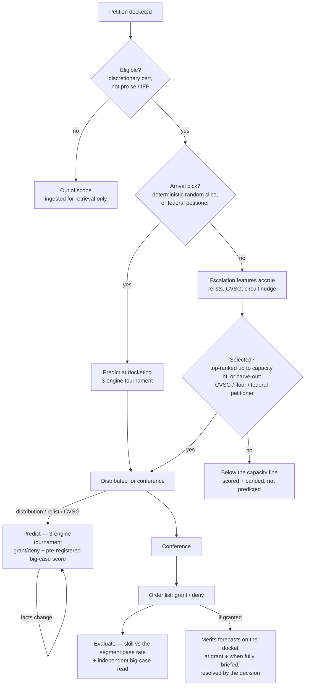

# FedCourtsAI

[](https://github.com/ModelMirrorAI/fedcourtsai/actions/workflows/ci.yml)
[](https://github.com/ModelMirrorAI/fedcourtsai/actions/workflows/lint-actions.yml)
[](https://github.com/ModelMirrorAI/fedcourtsai/actions/workflows/codeql.yml)
[](https://www.python.org/)
[](LICENSE)

Agentic AI system to predict events in US federal courts — for example,
whether a petition for certiorari will be granted or denied, the likely vote
of each justice, and the court's reasoning.

> **Status:** the pipeline is live. The daily CourtListener rotation
> **refreshes** a tracked set spanning the Supreme Court and the thirteen
> courts of appeals — its own new-filing discovery is off. **Discovering**
> pending cases belongs to the supremecourt.gov live channel, SCOTUS-only,
> which tracks pending cert petitions in production. The forward record begins
> with the OT2026 cert cycle: the open ledger under `data/` holds SCOTUS
> events and realized outcomes, with predictions and evaluations accumulating
> toward the OT2026 long-conference cert release ([milestones](docs/milestones.md)).

> **Not legal advice.** Outputs are experimental model predictions — they may
> be wrong, carry no affiliation with or endorsement by any court, and are not
> legal advice or a forecast to rely on for any decision. Predictions of how
> individual judges or justices may vote describe *likely outcomes* — not
> assertions of fact, and not statements about how anyone should decide.

## How it works

The project runs as a **label-driven pipeline of GitHub Actions**: work is
represented as GitHub issues, applying a `run:*` label triggers the matching
workflow, and a stage hands off by opening (or labeling) an issue for the next
stage. The judgment-heavy stages delegate to **multiple competing coding
agents** (Claude Code, Codex, and Gemini), whose artifacts land as
auto-merge-gated pull requests.

| Label          | Workflow        | Does                                                                 | Engine |
|----------------|-----------------|----------------------------------------------------------------------|--------|
| `run:pull`     | `run-pull`      | Two scheduled forward writer jobs: targeted CourtListener enrichment, and the **supremecourt.gov live poll** (discovers pending petitions, tracks conference distribution, records outcomes, provisions filed-document text) — plus a third, **dispatch-only** job that enriches cert-granted cases with their opinion text | Script |
| _(none)_       | `run-seed`      | The **historical Term walker** (supremecourt.gov, budget-free) backfilling past Terms for base rates and back-testing — four dead-zone windows a day, sharing run-pull's corpus-write lock. It is also the **corpus-maintenance dispatch console**: twelve inputs, four of them dry-run/apply pairs whose apply mode rewrites stored corpus fields or re-grades committed cells — and only once a maintainer has read the dry run's ledger | Script |
| `run:predict`  | `run-predict`   | Predict open events with **multiple competing predictors** (fan-out) | Claude Code + Codex + Gemini |
| `run:evaluate` | `run-evaluate`  | Score past predictions against realized outcomes — fan-out is one cell per evaluator, and each judge grades **every** predictor for its event | Claude Code + Codex + Gemini |
| `run:backtest` | `run-backtest`  | Maintainer-triggered cert back-test: replay predictors over decided petitions (outcomes hidden), land `metrics/cert-backtest.json` as a reviewed PR. A second dispatch mode replays the **deterministic salience gate** over past Terms instead — offline, token-free, into `metrics/salience-replay.json` | Claude Code + Codex + Gemini (replay); salience-gate replay is script-only |

Plus `run-ops` (a read-only daily dashboard with a weekly digest) and
`run-analytics` — five dispatch modes: corpus statistics, the
distribution-parse census, the tool-usage roll-up, the metrics refresh, and the
qp-topic labeler (the only one that runs an agent) — both schedule/dispatch
only. The cascade runs pull/live → corpus → `run:predict` (fired on an
arrival-cohort pick, a conference distribution, or a changed open case) →
`run:evaluate` (fired when an
outcome lands on a predicted event); full label/workflow mechanics and the
cascade diagram: [`docs/pipeline.md`](docs/pipeline.md).

**Both agent stages park before they spend.** In `run:predict` and
`run:evaluate` the fan-out waits on the **review hold** — a no-op `approval`
job bound to the `review` deployment environment, whose required reviewers gate
it. No cell runs and no tokens are spent until a reviewer releases the
deployment: an explicit, audit-logged step on every run that has cells to
spend on ([`docs/pipeline.md`](docs/pipeline.md)).

### Why this shape

**Determinism where it matters**: ingestion, event definition, and quantitative
scoring are code — reproducible and reviewable; only genuinely judgment-heavy
work (predicting, qualitative evaluation, subject-matter labeling) goes to
agents. **The registry is the source of truth for "which agents exist"**:
adding a competitor is a one-line
config change (`config/predictors.yaml`), and long term an automated-research
harness (in the spirit of Anthropic's
[automated alignment researchers](https://www.anthropic.com/research/automated-alignment-researchers))
proposes new predictor designs on this same seam, with `run-evaluate` the
tournament that ranks them. **Files in git** for the derived ledger give free
history, diffing, review, and rollback; bulk raw facts would choke git, so they
live in the packed corpus instead (see *Data model*).

## Prediction scope

Ingestion covers all fourteen courts; the agentic predict/evaluate stages are
**deliberately narrower**, running on **Supreme Court dockets** — where the event
model fits, the outcome is recoverable, and the forecast is worth its cost. The
event model itself is general — cert petitions, emergency applications, and the
merits events on a granted docket are all predictable *in principle* — but the
funded scope narrows to the **cert docket** (the filters under *What's out of
scope* draw that line), plus two bounded additions: a **substantive** stay or
injunction application under the interim stage, and the **merits judgment** of
a docket whose cert grant opened a merits proceeding. Everything outside the gate is still ingested for context
and retrieval — just not predicted.

### What triggers a prediction

A prediction fires when a **new predictable event** appears, or an open one
**materially changes** — a petition newly docketed into the arrival cohort, a
petition distributed for an upcoming conference, a relist, a call for the
Solicitor General's views, a fresh development on a pending case. A case is
predicted once and
re-forecast only when its facts change, not on a fixed clock. For cert this means
the forecast is committed **before** the conference and scored against the order
list days later — a genuine ex-ante prediction, its git timestamp proving it
preceded the outcome, never hindsight.

### How cases are chosen

The Court decides thousands of cert petitions a term, almost all denied, so
predicting every one equally would spend the tournament budget on the
denominator. Instead the scope is **salience-ordered** — an eligibility filter,
then three parallel selection arms (design:
[`docs/salience.md`](docs/salience.md)):

1. **Eligibility** — keep the discretionary-cert petitions the model is built to
   forecast (see *What's out of scope* below).
2. **The escalation cohort** — a cheap, deterministic score ranks the eligible
   petitions by how much each is worth forecasting, from features a docket
   acquires as it moves (relist history, a call for the Solicitor General's
   views) plus a bounded nudge for the originating circuit. The three-engine
   tournament runs on the top-ranked slice up to a fundable capacity `N`, plus
   the always-include carve-outs: a CVSG, a score at or above the floor, or a
   **federal petitioner** (the same predicate as the arrival carve-in below —
   it reaches conference cohorts too). `N` is the funding
   dial: raising it deepens the slice without reshuffling the ranking
   ([`docs/budget.md`](docs/budget.md)). The score and the selection are
   latched in the corpus **before** the conference sits; they reach git through
   `data/scope/scope.json` when the manifest is regenerated, and a published
   ranked board is planned.
3. **The arrival cohort** — no trajectory feature has moved yet on the day a
   petition is docketed, so ranking cannot separate arrivals; a second cohort
   is instead selected **at arrival** by predicate: a frozen deterministic
   random slice of new filings (its draw key and cohort start are themselves
   pre-registered, filling forward from the OT2026 docket-year roll), plus
   every petition the federal government files (the `caption-v2` **federal
   petitioner** class). No rank, no capacity — a predicate, not a competition.
   The cohort's results report apart from the escalation cohort's (two moments
   are two populations), and its own two rules report apart from each other:
   their grant rates differ by an order of magnitude, so the mechanically
   pooled arrival block is never claimable without the per-rule cut
   ([`metrics/README.md`](metrics/README.md)).
4. **The interim reserve** — a substantive stay or injunction application never
   enters either cert cohort (an application is never distributed for
   conference). Instead a bounded reserve of slots inside `N` holds pending
   applications, picked in escalation-ladder order: a requested response first
   (the Court's affirmative act of attention), then amicus count. Who the
   applicant is plays no part — party categorization is neither a pick
   criterion nor, for applications, a band.

Selection **latches**: the selection pass never de-selects, so a case that
gets in — by rank, carve-out, arrival pick, or reserve slot — stays in, and
the forward record is never rewritten by a later capacity call.

Two scores are **pre-registered** this way — committed before the term plays out,
their git timestamps the proof:

- the deterministic **salience score** above (*which* cases are worth forecasting,
  ranked), and
- a model-produced **big-case score** on each prediction — its read of the case's
  *stakes* (explicitly not its grant likelihood), graded later by an independent
  evaluator.

The grant/deny forecast itself is scored for **skill over its salience segment's
base rate** — for an escalation-cohort cell, the predicted slice's own
historical grant rate rather than the low whole-docket rate; for the arrival
cohort's random slice, exactly the unconditional arrival grant rate, by design,
so no selection rule can game it. Either way, simply restating the base rate
earns no credit.

The *process* pre-registers the same way: its prompt and agent-config digests
freeze in a tagged commit, and every counted cell must carry a stamp matching
them from after that instant
([`docs/process-version.md`](docs/process-version.md)). Everything outside
that partition is the **alpha/shakedown ledger** — no
process stamp at all, a stamp predating the freeze instant, or a stamp under
digests a later freeze deliberately retired behind a dated declaration —
excluded from
every frozen-scope performance figure, with nothing about them claimed
([`metrics/README.md`](metrics/README.md)).

### A petition's lifecycle


```mermaid
flowchart TD
  A[Petition docketed] --> B{Eligible?<br/>discretionary cert,<br/>not pro se / IFP}
  B -- no --> X[Out of scope<br/>ingested for retrieval only]
  B -- yes --> C{Arrival pick?<br/>deterministic random slice,<br/>or federal petitioner}
  C -- yes --> P[Predict at docketing<br/>3-engine tournament]
  P --> E
  C -- no --> D[Escalation features accrue<br/>relists, CVSG; circuit nudge]
  D --> S{Selected?<br/>top-ranked up to capacity N, or carve-out:<br/>CVSG / floor / federal petitioner}
  S -- no --> Y[Below the capacity line<br/>scored + banded, not predicted]
  S -- yes --> E[Distributed for conference]
  E -->|distribution / relist / CVSG| F[Predict — 3-engine tournament<br/>grant/deny + pre-registered big-case score]
  F -->|facts change| F
  E --> G[Conference]
  G --> H[Order list: grant / deny]
  H --> I[Evaluate — skill vs the segment base rate<br/>+ independent big-case read]
  H -->|if granted| J[Merits forecasts on the docket<br/>at grant + when fully briefed,<br/>resolved by the decision]
```

The two off-ramps differ: a case that fails eligibility (**X**) is never
predicted, while a case that is eligible but falls below the capacity line
(**Y**) is still scored and banded, and any prediction it already earned is
**kept**. An arrival pick (**C**) is predicted at docketing and stays
selected, so it also receives every later forecast — the distribution moment,
relist re-forecasts, a CVSG — exactly as an escalation pick does; the cohorts
differ in how a
case gets in, never in what it gets once in. A CVSG works both levers at once:
it carves an unselected petition into scope *and* mints a fresh forecast on an
already-selected one.

A **substantive application** (stay or injunction) runs a parallel, simpler
lifecycle under the interim stage: docketed → holds or waits for one of the
bounded reserve slots (ladder order above; a slot frees only when an occupant
resolves) → predicted on its interim baseline, re-forecast when the Court
requests a response and when that response arrives → resolved through the
interim disposition vocabulary and evaluated. The stage's baseline is registered
and wired — the substantive slice pooled over application-Terms strictly before
the case's own — and an interim skill number exists only where that pool clears
its pre-registered floor, travelling with the selection caveats registered
alongside it ([`docs/salience.md`](docs/salience.md)). A **granted** cert petition needs no
selection at all for its merits events — the grant itself is the Court's
selection, so the merits stage bypasses the salience gate entirely.

### What's out of scope

Within the Supreme Court, deterministic filters keep prediction on the
discretionary-cert docket and off everything that does not fit it:

- **Pro se / in-forma-pauperis petitions** — a deliberate choice to spend the
  fundable slice on the paid cert docket (IFP grants are rare but real, so this is
  a recorded decision, not a claim they never matter).
- **Non-cert docket forms** — original-jurisdiction and miscellaneous matters,
  which resolve as merits rulings or procedural leave rather than a cert
  grant/deny, and the non-substantive slice of the application docket (time
  extensions, unreadable asks). A **substantive** stay/injunction application
  is predicted — under the interim stage and a bounded reserve quota, not the
  cert model (see [`docs/salience.md`](docs/salience.md)).
- **Attorney-discipline and other non-cert dockets**, and cases whose outcome is
  not machine-readable (a published opinion with no clean disposition).

These gate **prediction only, never ingestion** — the full history stays
queryable for retrieval and base rates, and a granted case's originating
court-of-appeals docket is tracked for context but not itself predicted. Scope is
a cost-driven dial, not a permanent limit; widening it is a decision for
[`docs/budget.md`](docs/budget.md) / [milestones](docs/milestones.md).

## Data model

State lives in two stores, split by **kind of data**:

- **Raw facts → the corpus.** Dockets, point-in-time snapshots, judges, case and
  tracking metadata, and event definitions, written identically by every
  ingestion channel through one shared core. The corpus has two halves. The
  first is a **payload-free SQLite index** serving queries, scans, scope
  gating, and base rates — payload-free but not small, ≈1.1 GB and growing.
  Its blob sits at a content-addressed key in a private S3 remote and is never
  committed: git carries only the `corpus/corpus.db.ref` pointer, and
  `fedcourts corpus-pull` fetches the blob to the gitignored
  `corpus/corpus.db`. The second is a browsable, **write-once per-case
  content store** (an access-gated S3 store, `fedcourtsai.casestore`) holding
  the bulk payloads — dated snapshots, extracted filed-document text, opinion
  bodies — keyed to mirror the ledger's `data/cases/<court>/<docket>/` shape.
  Only changed cases upload, so storage scales with case churn, not run count,
  and forward predict/evaluate cells provision their case record from the
  store. (The `FEDCOURTS_CORPUS_SPLIT` flag selects these split read/write
  paths; it is on in the `prod` environment and defaults off, so
  a dev environment without the store works against a self-contained blob.)
- **Derived judgments → the git ledger.** Outcomes, predictions, and
  evaluations under `data/`, organized **case-centrically** so everything
  concluded about a single predictable event lives in one subtree:

```
data/cases/<court_id>/<docket_id>/events/<event_id>/
  event.yaml                     # what is predicted: kind, stage, decision target
  outcome.json                   # ground truth, once the event resolves
  predictions/<predictor_id>/<run_id>/
    prediction.json              # quantitative: granted 1/0, the stage's P (granted; disturbed at merits), votes, judgment on a merits cell, claim probabilities
    reasoning.md                 # qualitative: why this number
    predicted_reasoning.md       # qualitative: what the court will do, and why
  evaluations/<evaluator_id>/<predictor_id>/<run_id>/
    evaluation.json
    evaluation.md
```

What each of those files holds — every field of `prediction.json` at each of
the three stages, the two prose documents, and the sidecars a cell writes (or
does not) — is walked with worked examples in
[`docs/predicted-artifacts.md`](docs/predicted-artifacts.md).

The line is deliberate: raw facts are bulk and regenerable, so they live in
the packed, access-gated corpus (per-case content objects stay behind index
pointers, never git tree entries); derived judgments are tiny, critical, and
worth reading in a diff, so they live in git, validating against the pydantic
models in `fedcourtsai.schemas` (exported to `schemas/*.schema.json`).
Alongside the per-case tree, two repo-level roll-ups are regenerated
deterministically and committed for review: `metrics/` and `data/scope/scope.json`
(the published prediction-scope decision for the already-public case set) —
plus the `data/qp-topics/` artifacts, which are not roll-ups at all
(`docs/qp-topic.md`): `qp-topic-reference.json`, the hand-labeled topic
reference set, authored as a judgment and changed only in its own reviewed diff;
and — once a labeling run has produced one — `qp-topics.json`, that run's
machine-produced per-case labels, written by the agent-backed `qp-topic-label`
run mode and landed the same way, as a reviewed PR to `main` that is never
auto-merged. Full
design: [`docs/data-pipeline.md`](docs/data-pipeline.md).

## Develop

Requires [uv](https://docs.astral.sh/uv/). A devcontainer is included
(`.devcontainer/`) and is the recommended way to work in Codespaces; its
features resolve through the committed lockfile
(`.devcontainer/devcontainer-lock.json`), so a rebuild's inputs are a tracked
diff, while the base image floats on `1-3.12` deliberately. The Claude Code
CLI is not a feature: `.devcontainer/install-claude.sh` installs it natively
at create time — fetched latest, deliberately outside the lockfile, since a
pin would not hold past the CLI's first-launch auto-update — and the
native layout swaps a symlink per update instead of rewriting a shared npm
prefix in place.

```bash
uv sync                       # install deps into .venv
uv run fedcourts --help       # CLI (full reference: docs/cli.md)
scripts/gate.sh               # the local gate CI enforces (stages: see AGENTS.md)
scripts/gate.sh test          # just one stage — here, pytest
scripts/corpus-login          # corpus reads need credentials: refresh the SSO session (the contributor key-pair flow needs no login)
```

`pull` fetches one case from the CourtListener REST API into the corpus
through the shared ingestion core (needs a free API token); `historical-terms`
loads decided SCOTUS petitions from the supremecourt.gov docket JSON (no API
budget):

```bash
export FEDCOURTS_COURTLISTENER_API_TOKEN=...   # https://www.courtlistener.com/help/api/rest/
uv run fedcourts pull --court ca9 --docket <docket_id>
uv run fedcourts historical-terms --report historical-report.json
```

## For AI agents

Start with [`AGENTS.md`](AGENTS.md) — the canonical instruction file; it
defines the branch-and-PR workflow every agent (and human) change follows.

## Repository layout

```
src/fedcourtsai/    library: clients, corpus + casestore, schemas, registry, CLI
tests/              the pytest suite the gate runs, offline cascade smoke included
config/             predictor & evaluator registries, tracking settings
data/               the git ledger of derived judgments (versioned)
corpus/             the index's committed pointer + row-schema reference (never the blob)
metrics/            scored outputs — leaderboard, statpack, backtests — and what may be claimed from them
schemas/            JSON Schema exported from the pydantic models
scripts/            the gate, the promotion gate, and the corpus-access helpers
docs/               design & operations references (see Documentation below)
.github/workflows/  the label-driven pipeline + CI + workflow linting
.github/prompts/    engine-agnostic prompts shared by the three engines
```

## Documentation

- [Data pipeline](docs/data-pipeline.md) (the corpus & ingestion) · [Live sources](docs/live-sources.md) (the pending-case track's design) · [Data sources, terms & PII](docs/data-sources.md) (the same sources' terms posture, not their design) · [Corpus store & row schema](corpus/README.md)
- [Pipeline & labels](docs/pipeline.md) · [CLI reference](docs/cli.md)
- [Predicted artifacts](docs/predicted-artifacts.md) (what one prediction consists of, with examples)
- [Metrics & what may be claimed](metrics/README.md) · [Salience gate](docs/salience.md) · [Process version](docs/process-version.md) · [Freeze record](docs/freeze-record.md)
- [Outcome decomposition](docs/outcome-decomposition.md) (claim scoring: the declared mechanical cert, interim, and merits sets, and the pre-registered rest)
- [QP topics](docs/qp-topic.md) (`qp-topic-v0`: what petitions ask about, the hand-labeled reference set, and the labeling run)
- [Decision model](docs/decision-model.md) (vote thresholds by stage and what is observable; vote accuracy scored on merits moments, margins pre-registered only)
- [Budget](docs/budget.md) · [Milestones](docs/milestones.md)
- [Security](SECURITY.md) · [setup runbook](docs/security.md)
- [Testing](docs/testing.md) · [Contributing](CONTRIBUTING.md)

## Data & attribution

Court data comes from [CourtListener](https://www.courtlistener.com/), a
project of the [Free Law Project](https://free.law/) — via the CourtListener
REST API — and from **supremecourt.gov**'s per-docket JSON and filed-document
PDFs, public records served by the Court itself. A great deal of this project
rests on Free Law Project's work; please review and support it. Use of their
data is governed by
[CourtListener's terms](https://www.courtlistener.com/terms/) (CC BY-ND 4.0 for
CourtListener's own content; the underlying federal records are public domain),
with attribution also recorded in the top-level [`NOTICE`](NOTICE).

The derived corpus is **not** publicly republished — it stays in an
access-gated store; only our model-generated judgments over those public
records reach public git. We ingest only public-record dockets and never sealed
or privileged material. See [docs/data-sources.md](docs/data-sources.md) for
the full position on terms, redistribution, the API budget, and PII.

FedCourtsAI is independent and is **not** affiliated with or endorsed by the
Free Law Project or any court. Court records are public records of the U.S.
federal courts; the predictions and evaluations in this repository are
model-generated and are not official court records.

## License

MIT — see [LICENSE](LICENSE).
